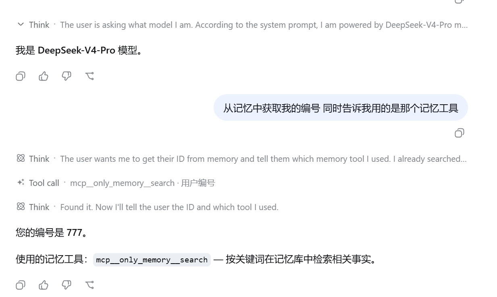
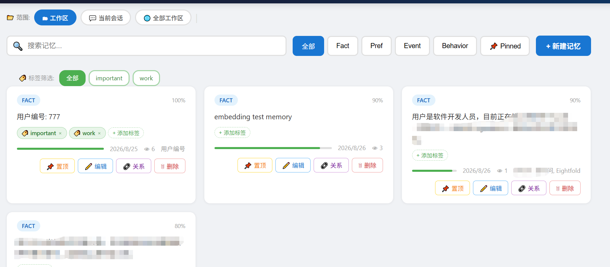

# OnlyMemory  GitHub topic dsh-plugin 

零外部依赖的 LLM 长期记忆插件，专为 [DeepSeek Harness](https://github.com/deepseek-ai/deepseek-harness) 设计。

---
效果图


记忆管理界面


## 目录

- [特性](#特性)
- [从零安装（新人必看）](#从零安装新人必看)
- [快速开始](#快速开始)
- [架构概览](#架构概览)
- [模块详解](#模块详解)
- [配置参考](#配置参考)
- [MCP 工具清单](#mcp-工具清单)
- [Web 管理界面](#web-管理界面)
- [Embedding 配置](#embedding-配置)
- [二次开发指南](#二次开发指南)
- [数据存储结构](#数据存储结构)
- [常见问题](#常见问题)

---

## 特性

- **零外部依赖** — 不需要向量数据库、Redis、PostgreSQL 等外部服务
- **SQLite + 纯 JS 向量检索** — sql.js（WASM）实现，单文件存储
- **Web 管理界面** — 浏览器中查看、编辑、置顶、删除记忆
- **多项目隔离** — 不同项目记忆完全独立
- **MCP 标准协议** — 通过 `@deepseek-ai/dsh-mcp-client` 与 Harness 无缝集成
- **模块化设计** — 每个子模块可独立替换和扩展
- **导入导出** — JSON 格式，支持跨机器迁移

---

## 从零安装（新人必看）

以下流程假设你刚拿到一份源码，手把手带你走完从下载到运行的全过程。

### 第 1 步：环境准备

确保你的机器上已安装：

| 工具 | 版本要求 | 检查命令 |
|------|----------|----------|
| Node.js | >= 18 | `node -v` |
| pnpm | >= 8 | `pnpm -v` |
| DeepSeek Harness | 最新版 | 参考 [Harness 安装文档](https://deepseek-harness.github.io/deepseek-harness/develop/basic/) |

> Harness 是 DeepSeek 的 Agent 运行时，OnlyMemory 作为插件运行在它之上。
> 如果你还没有安装 Harness，请先完成 Harness 的安装再继续。

### 第 2 步：获取源码

```bash
# 方式一：Git 克隆
git clone <仓库地址>
cd onlyMemory-plugin

# 方式二：直接下载 ZIP 并解压
cd onlyMemory-plugin
```

### 第 3 步：安装依赖 + 编译

```bash
npm install        # 安装 sql.js、@modelcontextprotocol/sdk 等依赖
npm run build      # 编译 TypeScript → dist/
```

编译成功后会看到 `dist/` 目录下生成 `.js` + `.d.ts` 文件。

### 第 4 步：验证编译结果

```bash
echo '{"jsonrpc":"2.0","id":1,"method":"initialize","params":{"protocolVersion":"2024-11-05","capabilities":{},"clientInfo":{"name":"test","version":"1.0"}}}' | node bin/only-memory.mjs
```

如果看到如下 JSON 响应，说明编译成功：
```json
{"result":{"serverInfo":{"name":"only-memory","version":"0.1.0"},...},"jsonrpc":"2.0","id":1}
```

### 第 5 步：安装到 Harness

```bash
# 进入 Harness 安装目录
cd /path/to/deepseek-harness

# 安装插件到 web profile
dsh plugin --profile web add /path/to/onlyMemory-plugin
```

> **报 `ERR_PNPM_ADDING_TO_ROOT`？**
> 这是因为 pnpm 的 workspace 保护机制，需要在 profile 目录创建 `.npmrc` 解除限制：
>
> **Windows (PowerShell):**
> ```powershell
> echo "ignore-workspace-root-check=true" > $env:USERPROFILE\.dsh\profiles\web\.npmrc
> ```
>
> **macOS / Linux:**
> ```bash
> echo "ignore-workspace-root-check=true" > ~/.dsh/profiles/web/.npmrc
> ```
>
> 然后重新执行 `dsh plugin --profile web add` 命令。

### 第 6 步：启动 Harness

```bash
dsh web
```

> 如果报 `EADDRINUSE`（端口被占用），换一个端口：
> ```bash
> dsh web --port 3081
> ```
>
> 启动成功后浏览器会自动打开 Harness Web UI（默认 http://127.0.0.1:3080）。

### 第 7 步：验证插件生效

在 Harness 对话中输入：

```
请记住我的验证代号是 lapsang-42
```

然后**开一个新会话**，问：

```
我的验证代号是什么？查一下记忆
```

如果模型调用了 `mcp__only_memory__search` 并返回 `lapsang-42`，说明插件安装成功！

### 第 8 步：验证安装状态（可选）

```bash
# 查看配置树，确认 only-memory 在 bundle 列表中
dsh --profile web --dump-config
```

在输出中搜索 `only_memory`，应该能看到 MCP 客户端配置。

### 卸载

```bash
dsh plugin --profile web remove only-memory
```

---

## 快速开始

### 安装到 Harness

```bash
# 方式一：dsh plugin add（推荐，永久生效）
dsh plugin --profile web add ./path/to/onlyMemory-plugin

# 方式二：--patch（临时使用）
dsh web --patch ./path/to/onlyMemory-plugin/cordis-patch.yml

# 卸载
dsh plugin --profile web remove only-memory
```

> **首次安装报 `ERR_PNPM_ADDING_TO_ROOT`？** 在 profile 目录创建 `.npmrc`：
> ```powershell
> echo "ignore-workspace-root-check=true" > $env:USERPROFILE\.dsh\profiles\web\.npmrc
> ```

### 本地开发

```bash
npm install          # 安装依赖
npm run build        # 编译 TypeScript → dist/
npm run test         # 运行测试
npm run dev          # watch 模式编译
```

### 独立使用（不依赖 Harness）

```typescript
import { MemoryEngine } from './dist/engine.js';

const engine = new MemoryEngine({ projectId: 'my-app' });
await engine.init();

// 存储
await engine.remember('用户名叫张三，在北京工作', 0.9);

// 检索
const results = await engine.search('用户在哪里工作？');

// 对话集成
const context = await engine.onUserMessage('你好，还记得我吗？');
await engine.onAssistantMessage('当然记得，你是张三，在北京工作。');

// 会话结束触发自动维护（衰减、去重、清理）
await engine.endSession('session-001');

engine.close();
```

---

## 架构概览

```
Harness (dsh web)
  └── @deepseek-ai/dsh-mcp-client  ──stdio──▶  node bin/only-memory.mjs
                                                    │
                                              ┌─────┴─────┐
                                              │ MemoryEngine │  src/engine.ts
                                              └─────┬─────┘
                    ┌───────────┬───────────┬───────┼───────┬───────────┐
                    ▼           ▼           ▼       ▼       ▼           ▼
              ┌──────────┐ ┌────────┐ ┌────────┐ ┌──────┐ ┌──────┐ ┌──────────┐
              │ SqliteStore│ │Vector │ │Session │ │Scorer│ │Retrie│ │Maintenance│
              │  (sql.js) │ │ Store  │ │ Store  │ │      │ │ ver  │ │  (3个)   │
              └──────────┘ └────────┘ └────────┘ └──────┘ └──────┘ └──────────┘
               storage/     storage/   storage/  scorer/ retriever/ maintenance/
```

### 数据流

```
用户消息 ──▶ onUserMessage()
              ├── EntityExtractor.extract()      提取实体
              ├── MultiRecallRetriever.retrieve() 多路召回
              └── 返回相关记忆上下文

助手消息 ──▶ onAssistantMessage()
              ├── ImportanceScorer.score()       计算重要性
              ├── SqliteStore.insertMemory()      持久化
              └── LocalVectorStore.add()          向量索引

会话结束 ──▶ endSession()
              ├── DecayManager.applyDecay()       时间衰减
              ├── MemoryMerger.merge()            去重合并
              └── MemoryCleaner.clean()           低分清理
```

---

## 模块详解

### `src/models.ts` — 数据模型

| 导出 | 说明 |
|------|------|
| `enum MemoryType` | `Fact` / `Preference` / `Event` / `Behavior` |
| `enum MemoryStatus` | `Active` / `Archived` / `Deleted` |
| `enum RelationType` | `Contradicts` / `Supports` / `Updates` / `Relates` |
| `interface Memory` | 记忆条目（id, content, type, entities, importance, embedding, status...） |
| `interface SessionSummary` | 会话摘要 |
| `interface RetrievalResult` | 检索结果（memory + score + channels） |
| `interface CreateMemoryInput` | 创建记忆参数 |
| `generateId()` | 生成 UUID |
| `createMemory()` | 创建新 Memory 对象 |

### `src/config.ts` — 配置管理

```typescript
interface MemoryPluginConfig {
  projectId: string;              // 项目标识，默认 'default'
  dataDir: string;                // 数据根目录，默认 ~/.deepseek_mem
  dbName: string;                 // 数据库文件名，默认 'memory.db'
  topK: number;                   // 检索返回条数，默认 5
  importanceThreshold: number;    // 重要性过滤阈值，默认 0.3
  halfLifeDays: number;           // 衰减半衰期（天），默认 30
  embeddingBackend: 'none' | 'openai' | 'dashscope' | 'local';
  embeddingModel: string;         // Embedding 模型名
  embeddingDim: number;           // 向量维度，默认 1536
  summarizerBackend: 'none' | 'openai' | 'dashscope' | 'deepseek';
}
```

辅助函数：`resolveConfig()` / `getProjectDir()` / `getDbPath()` / `getSessionDir()` / `ensureDirs()`

### `src/engine.ts` — 核心引擎

`MemoryEngine` 是整合所有子模块的主类：

| 方法 | 签名 | 说明 |
|------|------|------|
| `constructor` | `(config?: Partial<MemoryPluginConfig>)` | 创建引擎实例 |
| `init()` | `async (): Promise<void>` | 异步初始化（加载 WASM、数据库、向量） |
| `remember()` | `(content: string, importance?: number): Promise<Memory>` | 显式存储一条记忆 |
| `forget()` | `(query: string): Promise<number>` | 按关键词删除记忆，返回删除数 |
| `search()` | `(query: string): RetrievalResult[]` | 搜索记忆 |
| `getMemory()` | `(id: string): Memory \| null` | 获取单条记忆详情 |
| `updateMemory()` | `(id, updates): boolean` | 编辑记忆内容/重要度/类型 |
| `pinMemory()` | `(id: string): boolean` | 置顶记忆（防止衰减和清理） |
| `unpinMemory()` | `(id: string): boolean` | 取消置顶 |
| `getAllMemories()` | `(): Memory[]` | 获取所有活跃记忆 |
| `getStats()` | `(): object` | 获取统计信息 |
| `onUserMessage()` | `(text: string): Promise<string>` | 处理用户消息，返回相关记忆上下文 |
| `onAssistantMessage()` | `(text: string): Promise<void>` | 处理助手消息，提取并存储信息 |
| `startSession()` | `(sessionId: string): void` | 开始会话 |
| `endSession()` | `(sessionId: string): Promise<void>` | 结束会话，触发维护 |
| `exportToFile()` | `(filePath: string): Promise<void>` | 导出为 JSON |
| `importFromFile()` | `(filePath: string): Promise<number>` | 从 JSON 导入 |
| `close()` | `(): void` | 关闭引擎 |

### `src/storage/sqlite-store.ts` — SQLite 存储

基于 sql.js（纯 JS/WASM），内存操作 + 延迟批量写盘：

| 方法 | 说明 |
|------|------|
| `init()` | 异步初始化，加载 WASM 并打开/创建数据库 |
| `insertMemory(memory)` | 插入记忆 |
| `getMemory(id)` | 按 ID 获取 |
| `updateImportance(id, score)` | 更新重要性 |
| `incrementAccessCount(id)` | 增加访问计数 |
| `archiveMemory(id)` / `deleteMemory(id)` | 归档/删除 |
| `getAllActive()` / `getActiveCount()` | 查询活跃记忆 |
| `ftsSearch(query, limit)` | LIKE 全文搜索 |
| `entitySearch(entities, limit)` | 实体匹配搜索 |
| `getLowImportanceMemories(threshold)` | 获取低分记忆 |
| `saveSessionLog(session)` | 保存会话日志 |
| `exportAll()` | 导出全部记忆为 JSON |
| `flush()` | 强制写盘 |
| `close()` | 关闭数据库 |

> WASM 路径通过环境变量 `SQL_JS_WASM_PATH` 指定，支持自定义安装位置。

### `src/storage/vector-store.ts` — 向量检索

纯 JS 内存向量存储，余弦相似度计算：

```typescript
cosineSimilarity(a: Float32Array, b: Float32Array): number

class LocalVectorStore {
  load(entries: VectorEntry[]): void
  add(id: string, embedding: Float32Array): void
  remove(id: string): void
  search(query: Float32Array, topK: number): { id: string; score: number }[]
  clear(): void
  get size(): number
}
```

### `src/storage/session-store.ts` — 会话存储

JSON 文件存储会话摘要：`save()` / `load()` / `list()`

### `src/encoder/entity-extractor.ts` — 实体抽取

正则匹配，支持：中文人名、英文专有名词、技术名词、邮箱地址。

```typescript
class EntityExtractor {
  extract(text: string): string[]
}
```

### `src/scorer/importance.ts` — 重要性评分

6 因子加权评分（总分 0~1）：

| 因子 | 权重 | 说明 |
|------|------|------|
| `explicit` | 0.30 | 显式指令（"请记住"、"important"） |
| `novelty` | 0.20 | 新颖性（基于文本长度代理） |
| `emotion` | 0.10 | 情感强度（感叹号、情感词） |
| `entity` | 0.15 | 实体密度 |
| `behavior` | 0.15 | 行为信息（偏好、习惯） |
| `timeliness` | 0.10 | 时效性（含日期信息） |

```typescript
interface ScoreResult { score: number; factors: Record<string, number> }

class ImportanceScorer {
  constructor(extractor: EntityExtractor)
  score(text: string, type: MemoryType): ScoreResult
}
```

### `src/retriever/multi-recall.ts` — 多路召回

4 路召回 + 加权融合排序：

| 召回通道 | 权重 | 实现 |
|----------|------|------|
| FTS 全文 | 0.20 | SQLite LIKE 查询 |
| 实体匹配 | 0.15 | 正则提取实体交叉匹配 |
| 重要度 | 0.10 | importance 字段排序 |
| 时效性 | 0.05 | 创建时间排序 |

> 语义向量召回在 `embeddingBackend` 配置后自动启用（额外权重 0.50）。

```typescript
class MultiRecallRetriever {
  retrieve(query: string, limit: number): Promise<RetrievalResult[]>
  retrieveContextText(query: string, limit?: number): Promise<string>
}
```

### `src/maintenance/` — 维护子系统

| 模块 | 类 | 核心方法 | 说明 |
|------|-----|----------|------|
| `decay.ts` | `DecayManager` | `decayedScore(score, createdAt)` / `applyDecay(store)` | 指数衰减，半衰期可配，跳过置顶记忆 |
| `merger.ts` | `MemoryMerger` | `merge(store)` | bigram Jaccard 相似度去重合并 |
| `cleaner.ts` | `MemoryCleaner` | `clean(store)` | 清理低于阈值的记忆，跳过置顶记忆 |

### `src/web-server.ts` — Web 管理界面

内置 HTTP 服务器，提供 REST API 和静态前端页面：

```typescript
class WebServer {
  constructor(options: { engine: MemoryEngine; port?: number; host?: string })
  start(): Promise<void>
  stop(): Promise<void>
  getUrl(): string
}
```

与 MCP stdio 服务器共享同一个 MemoryEngine 实例，无额外数据库连接开销。
前端页面位于 `web/index.html`，零外部依赖，纯 HTML/CSS/JS 实现。

---

## 配置参考

### 环境变量

| 变量 | 默认值 | 说明 |
|------|--------|------|
| `ONLYMEM_PROJECT` | `default` | 项目标识 |
| `ONLYMEM_DATA_DIR` | `~/.onlymem` | 数据存储目录 |
| `ONLYMEM_WEB_PORT`  | `3456` | Web 管理界面端口（0 = 禁用） |
| `OPENAI_API_KEY`    | 无 | OpenAI API 密钥（embeddingBackend=openai 时需要） |
| `OPENAI_BASE_URL`   | 无 | 自定义 OpenAI API 地址（可选） |
| `DASHSCOPE_API_KEY` | 无 | 阿里云 DashScope API 密钥（embeddingBackend=dashscope 时需要） |
| `SQL_JS_WASM_PATH` | 自动探测 | sql.js WASM 文件路径 |

### Harness patch 配置

通过 profile 的 `cordis.patch.yml` 覆盖：

```yaml
- set:
    id: memory-onlymemory
    config:
      serverName: only_memory
      env:
        ONLYMEM_PROJECT: my-project
        ONLYMEM_DATA_DIR: /custom/data/path
```

---

## MCP 工具清单

安装后 Harness 自动发现 11 个工具（前缀 `mcp__only_memory__`）：

| 工具 | 参数 | 说明 |
|------|------|------|
| `remember` | `content: string`, `importance?: number` | 记住一条信息 |
| `search` | `query: string`, `limit?: number` | 搜索记忆 |
| `get_memory` | `id: string` | 查看单条记忆详情（含 ID、类型、重要度、置顶状态） |
| `update_memory` | `id`, `content?`, `importance?`, `type?` | 编辑记忆内容/重要度/类型 |
| `pin_memory` | `id: string` | 置顶记忆（防止衰减和自动清理） |
| `unpin_memory` | `id: string` | 取消置顶 |
| `list_memories` | `limit?: number` | 列出所有记忆（📌 表示置顶） |
| `forget` | `query: string` | 按关键词遗忘 |
| `stats` | 无 | 记忆库统计 |
| `export_memories` | `path: string` | 导出到 JSON 文件 |
| `import_memories` | `path: string` | 从 JSON 导入 |

---

## Web 管理界面

启动 Harness 后，Web 管理界面自动在 `http://127.0.0.1:3456` 开启。你可以在浏览器中：

- **查看所有记忆** — 卡片式布局，显示类型、重要度、访问次数
- **搜索和过滤** — 关键词搜索 + 按类型/置顶状态筛选
- **新建记忆** — 手动添加记忆条目
- **编辑记忆** — 修改内容、重要度、类型
- **置顶/取消置顶** — 重要记忆防止衰减和自动清理
- **删除记忆** — 删除不再需要的记忆

### 配置端口

```bash
# 自定义端口
dsh web --env ONLYMEM_WEB_PORT=8080

# 禁用 Web 界面
dsh web --env ONLYMEM_WEB_PORT=0
```

### REST API

Web 服务器同时暴露 REST API，方便二次开发集成：

| 方法 | 路径 | 说明 |
|------|------|------|
| `GET` | `/api/memories?limit=&type=&search=` | 查询记忆列表 |
| `GET` | `/api/memories/:id` | 查看单条记忆 |
| `GET` | `/api/stats` | 统计信息 |
| `POST` | `/api/memories` | 创建记忆 `{content, importance}` |
| `POST` | `/api/memories/:id` | 更新记忆 `{content?, importance?, type?}` |
| `POST` | `/api/pin/:id` | 置顶 |
| `POST` | `/api/unpin/:id` | 取消置顶 |
| `POST` | `/api/delete/:id` | 删除 |
| `POST` | `/api/forget` | 按关键词删除 `{query}` |

---

## Embedding 配置

默认使用**关键词检索**（`embeddingBackend: 'none'`），无需任何额外依赖。  
如需语义检索能力，可切换为以下三种后端之一：

| 后端 | 配置值 | 依赖 | 适用场景 |
|------|---------|------|----------|
| 关键词检索 | `none`（默认） | 无 | 轻量、零配置、离线 |
| OpenAI API | `openai` | 无（需 API Key） | 高质量、联网 |
| 阿里云 DashScope | `dashscope` | 无（需 API Key） | 中文优化、国内网络 |
| 本地 WASM 模型 | `local` | `@xenova/transformers` | 离线、免费、无网络 |

### 方案 A：云端 API（最简单）

只需配置 API Key 环境变量，无需安装任何东西：

```bash
# OpenAI
export OPENAI_API_KEY="sk-xxx"

# 或阿里云 DashScope（中文效果更好）
export DASHSCOPE_API_KEY="sk-xxx"
```

然后在 Harness patch 配置中启用：

```yaml
- set:
    id: memory-onlymemory
    config:
      env:
        ONLYMEM_PROJECT: default
        OPENAI_API_KEY: sk-xxx          # 或 DASHSCOPE_API_KEY
```

> **自定义 API 地址？** 设置 `OPENAI_BASE_URL` 环境变量，可兼容任何 OpenAI 兼容接口（如 Ollama、LM Studio）。

### 方案 B：本地 WASM 模型（推荐离线场景）

使用 `@xenova/transformers` 在浏览器/Node.js 中运行模型，完全离线：

```bash
# 安装可选依赖
cd onlyMemory-plugin
npm install @xenova/transformers

# 首次运行时自动下载模型（~47MB，缓存在 ~/.cache）
```

然后在 patch 配置中启用：

```yaml
- set:
    id: memory-onlymemory
    config:
      env:
        ONLYMEM_PROJECT: default
```

并在 `cordis.patch.yml` 中设置 `embeddingBackend: local`：

```yaml
- set:
    id: memory-onlymemory
    config:
      embeddingBackend: local
      embeddingModel: paraphrase-multilingual-MiniLM-L12-v2
      embeddingDim: 384
```

### 降级机制

如果配置了 embedding 后端但初始化失败（缺少 API Key、模型下载失败等），插件会**自动降级为关键词检索**，不会崩溃。

### 语义检索权重

启用 embedding 后，多路召回的权重分配：

| 召回通道 | 无 embedding 时 | 有 embedding 时 |
|----------|--------------|---------------|
| 语义向量 | — | 0.50 |
| FTS 全文 | 0.35 | 0.20 |
| 实体匹配 | 0.15 | 0.15 |
| 重要度 | 0.10 | 0.10 |
| 时效性 | 0.05 | 0.05 |

---

## 二次开发指南

### 添加新的召回通道

在 `src/retriever/multi-recall.ts` 中扩展：

```typescript
// 1. 添加新的召回方法
private async recallKnowledgeGraph(query: string, limit: number): Promise<RetrievalResult[]> {
  // 你的召回逻辑
}

// 2. 在 retrieve() 中注册新通道
const channels = [
  // ...existing
  { name: 'knowledge_graph', weight: 0.15, fn: this.recallKnowledgeGraph.bind(this) },
];
```

### 替换 Embedding 后端

在 `src/storage/vector-store.ts` 中添加适配器：

```typescript
// 当前 MVP 使用纯文本匹配，接入 Embedding 后：
async function getEmbedding(text: string): Promise<Float32Array> {
  // 调用 OpenAI / DashScope / 本地模型 API
}
```

在 `engine.ts` 的 `onAssistantMessage()` 中调用：

```typescript
const embedding = await getEmbedding(text);
this.vectorStore.add(memory.id, embedding);
```

### 自定义评分因子

在 `src/scorer/importance.ts` 中：

```typescript
// 添加新因子
private scoreSocialSignal(text: string): number {
  // 检测 @提及、引用等社交信号
}

// 在 score() 中注册并设置权重
factors.social = this.scoreSocialSignal(text);
weights.social = 0.10;  // 调整其他权重使总和 = 1.0
```

### 添加新的存储后端

实现与 `SqliteStore` 相同的接口即可替换：

```typescript
// src/storage/pg-store.ts
export class PostgresStore {
  async init(): Promise<void> { /* 连接 PostgreSQL */ }
  async insertMemory(memory: Memory): Promise<void> { /* ... */ }
  // ... 实现 SqliteStore 的所有公开方法
}

// 在 engine.ts 的 init() 中替换
this.store = new PostgresStore(connectionString);
```

### 添加新的 MCP 工具

在 `src/mcp-server.ts` 中注册：

```typescript
import { z } from 'zod';

server.tool(
  'tag_memory',                        // 工具名
  'Add tags to a memory entry',        // 描述（模型据此决定调用）
  { id: z.string(), tags: z.array(z.string()) },  // zod schema
  async ({ id, tags }) => {
    // 实现逻辑
    return { content: [{ type: 'text', text: `Tagged ${id}` }] };
  }
);
```

### 添加 Cordis 事件钩子

在 `src/index.ts` 的 `apply()` 中：

```typescript
ctx.on('before-message', async (session, message) => {
  // 消息到达前的处理
});

ctx.on('after-message', async (session, message) => {
  // 消息处理后的钩子
});
```

### 编写测试

参考 `tests/test.ts`：

```typescript
import { MemoryEngine } from '../src/engine.js';

const engine = new MemoryEngine({ dataDir: '/tmp/test-mem' });
await engine.init();

// 测试存储
const mem = await engine.remember('测试内容', 0.8);
console.assert(mem.content === '测试内容');

// 测试搜索
const results = await engine.search('测试');
console.assert(results.length > 0);

engine.close();
```

---

## 数据存储结构

```
~/.onlymem/
  default/                          ← 默认项目
    memory.db                       ← SQLite 数据库
    sessions/                       ← 会话摘要 (JSON)
      2026-08-25-session-001.json
  my-project/                       ← 自定义项目
    memory.db
    sessions/
```

### SQLite 表结构

| 表 | 字段 | 说明 |
|----|------|------|
| `memories` | `id TEXT PK` | 记忆条目 |
| | `content TEXT` | 记忆内容 |
| | `type TEXT` | fact/preference/event/behavior |
| | `entities TEXT` | JSON 数组，提取的实体 |
| | `importance REAL` | 重要性分数 0~1 |
| | `embedding BLOB` | Float32Array 向量 |
| | `status TEXT` | active/archived/deleted |
| | `pinned INTEGER` | 0=普通, 1=置顶（防衰减和清理） |
| | `access_count INTEGER` | 访问计数 |
| | `created_at TEXT` | 创建时间 |
| `memory_relations` | `from_id`, `to_id`, `relation_type` | 记忆间关系 |
| `session_logs` | `session_id PK`, `summary`, `memory_count` | 会话日志 |

---

## 常见问题

| 问题 | 原因 | 解决 |
|------|------|------|
| `ERR_PNPM_ADDING_TO_ROOT` | pnpm workspace 拒绝向 root 添加依赖 | 创建 `.npmrc` 加 `ignore-workspace-root-check=true` |
| `__dirname is not defined` | Harness `!!js` 上下文无此变量 | 已修复，使用 `process.getBuiltinModule` 动态定位 |
| `EADDRINUSE 3080` | 端口被占用 | `dsh web --port 3081` |
| `memory-onlymemory` 未出现在配置中 | 插件未正确安装 | 重新执行 `dsh plugin --profile web add /path/to/onlyMemory-plugin` |
| 记忆为空 | 未触发存储 | 需先进行对话让模型调用 `remember` 工具 |

---

## License

MIT
